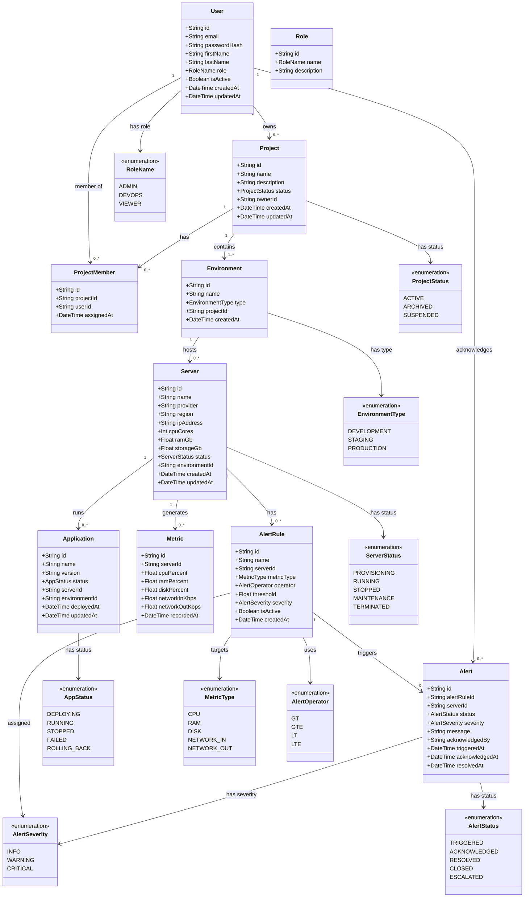

# Class Diagram

Domain model showing all 10 entities, their key attributes, and relationships.

```mermaid
classDiagram
    class User {
        +String id
        +String email
        +String passwordHash
        +String firstName
        +String lastName
        +RoleName role
        +Boolean isActive
        +DateTime createdAt
        +DateTime updatedAt
    }

    class Role {
        +String id
        +RoleName name
        +String description
    }

    class Project {
        +String id
        +String name
        +String description
        +ProjectStatus status
        +String ownerId
        +DateTime createdAt
        +DateTime updatedAt
    }

    class ProjectMember {
        +String id
        +String projectId
        +String userId
        +DateTime assignedAt
    }

    class Environment {
        +String id
        +String name
        +EnvironmentType type
        +String projectId
        +DateTime createdAt
    }

    class Server {
        +String id
        +String name
        +String provider
        +String region
        +String ipAddress
        +Int cpuCores
        +Float ramGb
        +Float storageGb
        +ServerStatus status
        +String environmentId
        +DateTime createdAt
        +DateTime updatedAt
    }

    class Application {
        +String id
        +String name
        +String version
        +AppStatus status
        +String serverId
        +String environmentId
        +DateTime deployedAt
        +DateTime updatedAt
    }

    class Metric {
        +String id
        +String serverId
        +Float cpuPercent
        +Float ramPercent
        +Float diskPercent
        +Float networkInKbps
        +Float networkOutKbps
        +DateTime recordedAt
    }

    class AlertRule {
        +String id
        +String name
        +String serverId
        +MetricType metricType
        +AlertOperator operator
        +Float threshold
        +AlertSeverity severity
        +Boolean isActive
        +DateTime createdAt
    }

    class Alert {
        +String id
        +String alertRuleId
        +String serverId
        +AlertStatus status
        +AlertSeverity severity
        +String message
        +String acknowledgedBy
        +DateTime triggeredAt
        +DateTime acknowledgedAt
        +DateTime resolvedAt
    }

    %% Enumerations
    class RoleName {
        <<enumeration>>
        ADMIN
        DEVOPS
        VIEWER
    }

    class ProjectStatus {
        <<enumeration>>
        ACTIVE
        ARCHIVED
        SUSPENDED
    }

    class EnvironmentType {
        <<enumeration>>
        DEVELOPMENT
        STAGING
        PRODUCTION
    }

    class ServerStatus {
        <<enumeration>>
        PROVISIONING
        RUNNING
        STOPPED
        MAINTENANCE
        TERMINATED
    }

    class AppStatus {
        <<enumeration>>
        DEPLOYING
        RUNNING
        STOPPED
        FAILED
        ROLLING_BACK
    }

    class MetricType {
        <<enumeration>>
        CPU
        RAM
        DISK
        NETWORK_IN
        NETWORK_OUT
    }

    class AlertOperator {
        <<enumeration>>
        GT
        GTE
        LT
        LTE
    }

    class AlertSeverity {
        <<enumeration>>
        INFO
        WARNING
        CRITICAL
    }

    class AlertStatus {
        <<enumeration>>
        TRIGGERED
        ACKNOWLEDGED
        RESOLVED
        CLOSED
        ESCALATED
    }

    %% Relationships
    User "1" --> "0..*" Project : owns
    User "1" --> "0..*" ProjectMember : member of
    Project "1" --> "0..*" ProjectMember : has
    Project "1" --> "1..*" Environment : contains
    Environment "1" --> "0..*" Server : hosts
    Server "1" --> "0..*" Application : runs
    Server "1" --> "0..*" Metric : generates
    Server "1" --> "0..*" AlertRule : has
    AlertRule "1" --> "0..*" Alert : triggers
    User "1" --> "0..*" Alert : acknowledges

    User --> RoleName : has role
    Project --> ProjectStatus : has status
    Environment --> EnvironmentType : has type
    Server --> ServerStatus : has status
    Application --> AppStatus : has status
    AlertRule --> MetricType : targets
    AlertRule --> AlertOperator : uses
    AlertRule --> AlertSeverity : assigned
    Alert --> AlertStatus : has status
    Alert --> AlertSeverity : has severity
```
