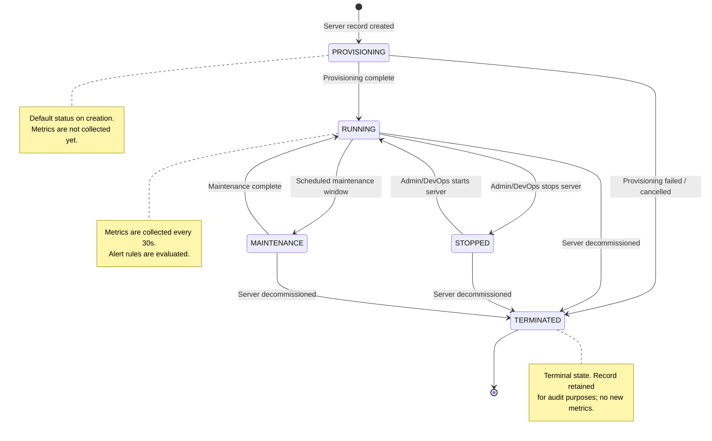
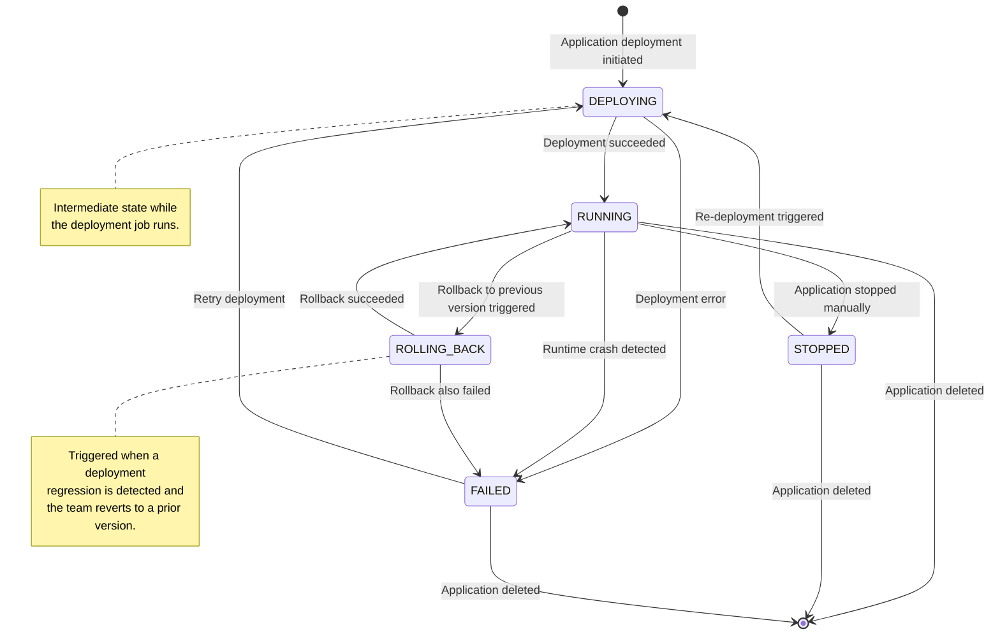
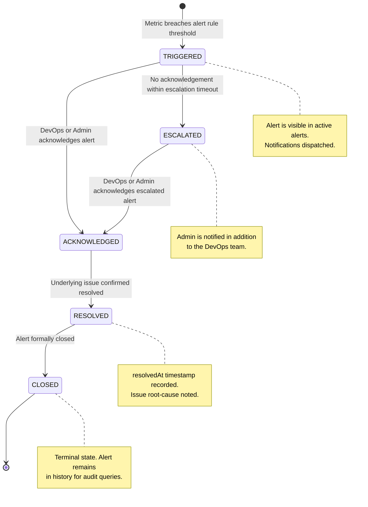

# State Diagrams

Three state machines for the main lifecycle objects in CloudOps Manager.

---

## 1. Server Status

```mermaid
stateDiagram-v2
    [*] --> PROVISIONING : Server record created

    PROVISIONING --> RUNNING : Provisioning complete
    PROVISIONING --> TERMINATED : Provisioning failed / cancelled

    RUNNING --> STOPPED : Admin/DevOps stops server
    RUNNING --> MAINTENANCE : Scheduled maintenance window
    RUNNING --> TERMINATED : Server decommissioned

    STOPPED --> RUNNING : Admin/DevOps starts server
    STOPPED --> TERMINATED : Server decommissioned

    MAINTENANCE --> RUNNING : Maintenance complete
    MAINTENANCE --> TERMINATED : Server decommissioned

    TERMINATED --> [*]

    note right of PROVISIONING
        Default status on creation.
        Metrics are not collected yet.
    end note

    note right of RUNNING
        Metrics are collected every 30s.
        Alert rules are evaluated.
    end note

    note right of TERMINATED
        Terminal state. Record retained
        for audit purposes; no new metrics.
    end note
```

---

## 2. Application Status

```mermaid
stateDiagram-v2
    [*] --> DEPLOYING : Application deployment initiated

    DEPLOYING --> RUNNING : Deployment succeeded
    DEPLOYING --> FAILED : Deployment error

    RUNNING --> STOPPED : Application stopped manually
    RUNNING --> FAILED : Runtime crash detected

    STOPPED --> DEPLOYING : Re-deployment triggered

    FAILED --> DEPLOYING : Retry deployment

    ROLLING_BACK --> RUNNING : Rollback succeeded
    ROLLING_BACK --> FAILED : Rollback also failed

    RUNNING --> ROLLING_BACK : Rollback to previous version triggered

    RUNNING --> [*] : Application deleted
    STOPPED --> [*] : Application deleted
    FAILED --> [*] : Application deleted

    note right of DEPLOYING
        Intermediate state while
        the deployment job runs.
    end note

    note right of ROLLING_BACK
        Triggered when a deployment
        regression is detected and
        the team reverts to a prior version.
    end note
```

---

## 3. Alert / Incident Status

```mermaid
stateDiagram-v2
    [*] --> TRIGGERED : Metric breaches alert rule threshold

    TRIGGERED --> ACKNOWLEDGED : DevOps or Admin acknowledges alert
    TRIGGERED --> ESCALATED : No acknowledgement within escalation timeout

    ESCALATED --> ACKNOWLEDGED : DevOps or Admin acknowledges escalated alert

    ACKNOWLEDGED --> RESOLVED : Underlying issue confirmed resolved

    RESOLVED --> CLOSED : Alert formally closed

    CLOSED --> [*]

    note right of TRIGGERED
        Alert is visible in active alerts.
        Notifications dispatched.
    end note

    note right of ESCALATED
        Admin is notified in addition
        to the DevOps team.
    end note

    note right of RESOLVED
        resolvedAt timestamp recorded.
        Issue root-cause noted.
    end note

    note right of CLOSED
        Terminal state. Alert remains
        in history for audit queries.
    end note
```
